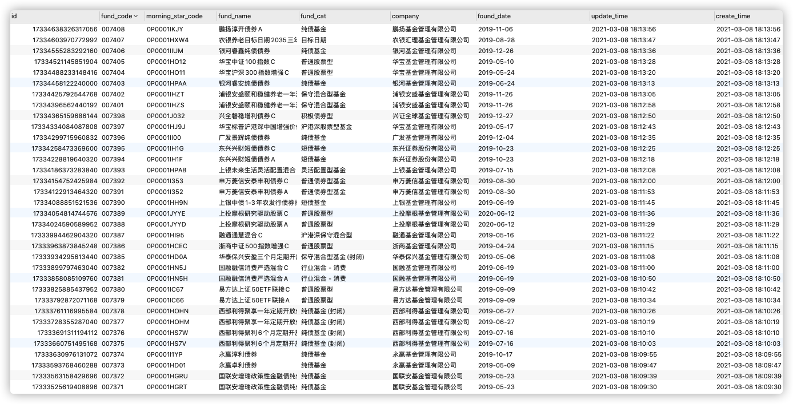
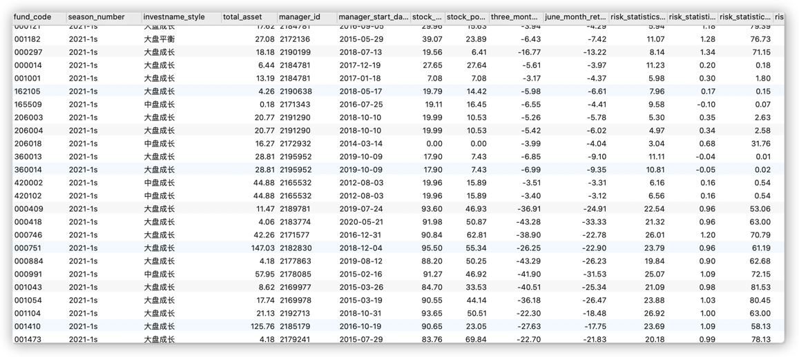
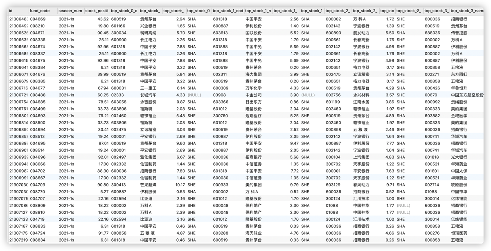
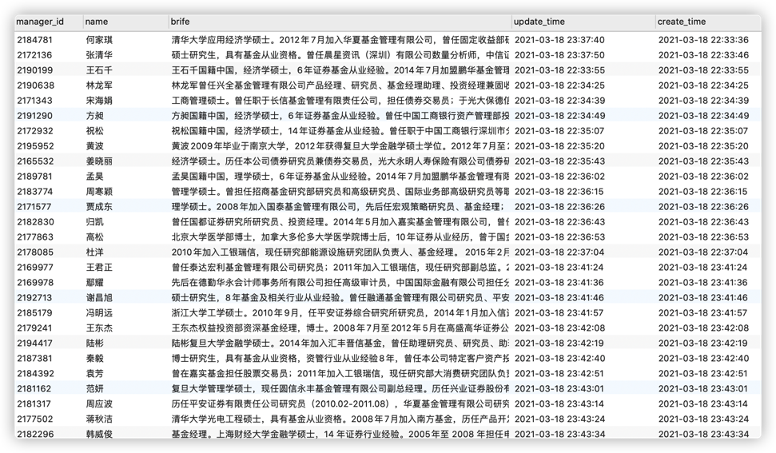
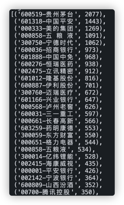
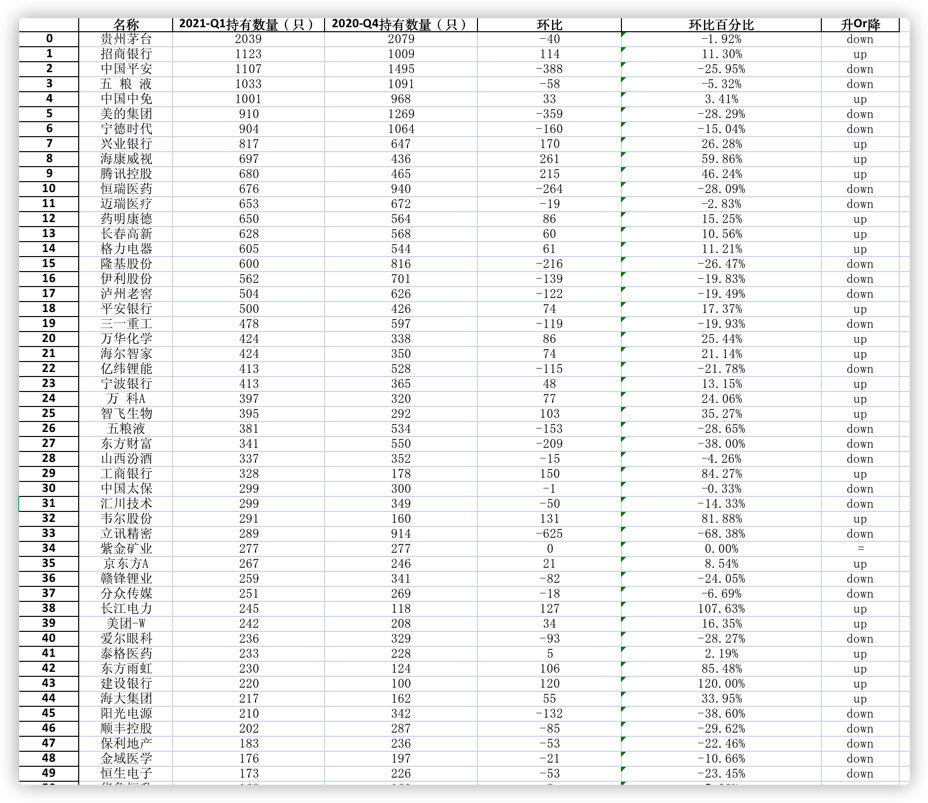

# 晨星基金数据爬取

# Table of Contents

- [前言](#前言)
- [数据爬取](#数据爬取)
  - [晨星列表数据](#晨星列表数据)
  - [晨星基金详情页数据--不变数据](#晨星基金详情页数据--不变数据)
  - [晨星基金详情页数据--季度变动数据](#晨星基金详情页数据--季度变动数据)
  - [晨星基金详情页数据--十大持仓股票信息](#晨星基金详情页数据--十大持仓股票信息)
  - [晨星基金经理](#晨星基金经理)
- [技术点](#技术点)
- [爬虫流程](#爬虫流程)
- [本地运行](#本地运行)
- [其他](#其他)
- [数据汇总&分析](#数据汇总&分析)

## 前言

晨星网，国际权威评级机构 Morningstar 的中国官方网站，所以它的基金评级是很有参考性的。

## 数据爬取

### 晨星列表数据

> 爬取晨星网筛选列表，包括基金代码，基金专属代码，基金分类，三年评级，五年评级这些维度等，有了这些基本数据，为了爬取基金详情页，基金筛选等铺好数据基础。

列表爬取数据截图：


### 晨星基金详情页数据--不变数据

> 爬取基金详情页的数据， 根据`晨星列表数据` 数据，遍历爬取单支基金的详情页数据（包括名称，代码，分类，成立时间，基金公司）等维度，后续还有根据这些数据爬取基金的持仓信息，为后面筛选股票做好进一步铺垫



### 晨星基金详情页数据--季度变动数据

> 爬取基金详情页的数据， 根据第二部分`晨星基础数据` 数据，过滤掉货币，纯债基金，爬取单支基金的详情页数据（包括总资产，投资风格，各种风险信息，评级，股票，债券持仓比例等）等维度



### 晨星基金详情页数据--十大持仓股票信息

> 爬取基金详情页的数据， 根据第二部分`晨星基础数据` 数据，过滤掉没有持有股票的基金，爬取单支基金的十大持仓股票信息（包括每只股票的代码，名称，占比）等维度



### 晨星基金经理

> 爬取基金详情页的数据，据此爬取基金经理数据
> 

## 技术点

- `selenium` 模拟登录， 切换分页
- `BeautifulSoup` 解析 HTML
- `pandas` 处理数据
- 工具 — 数据库用了`pymysql` , id 使用雪花 id，验证码识别使用了`pytesseract`
- 多线程爬取

## 爬虫流程

1. `selenium` 模拟登录：
   - 可采用验证码识别方式
   - 设置已经登录好的账号 cookies
2. 利用`BeautifulSoup` 解析 html，提取当前页的基金列表信息，存入到 mysql 中，或者追加到 csv 中 （目前仅 acquire_fund_snapshot.py 支持导出 csv）
3. `selenium` 模拟切换分页，重复第二，第三步
4. 所有的页数据爬取完，退出浏览器

## 本地运行

> 本地前置条件： 安装好 chromedriver 驱动， 安装 tesseract 并将 tesseract 加到环境变量下(识别二维码需要，如果是设置 cookies 方式则不需要)，如果是需要连接数据库的话，还要配置好表结构

1. 从环境参数模板（.env.example）中复制一份文件（.env）,修改本地环境变量

   > `cp .env.example .env`

根据自己情况改环境变量值，例如晨星用户名，密码，执行特定的爬虫脚本

2. 文件目录介绍

```bash
.
├── .env                         #本地环境配置参数
├── .env.example                 #环境配置参数模板实例
├── .gitignore
├── README.md
├── requirements.txt
└── src
    ├── acquire_fund_base.py     # 爬取基金基础数据-- 一些不变动的数据，例如成立时间
    ├── acquire_fund_quarter.py  # 爬取基金季度变动 -- 例如持仓数据
    ├── acquire_fund_snapshot.py # 基金列表快照数据 —— 列表数据
    ├── assets                   # 一些静态资源,例如星级图片
    │   └── star
    │       ├── star0.gif
    │       ├── star1.gif
    │       ├── star2.gif
    │       ├── star3.gif
    │       ├── star4.gif
    │       ├── star5.gif
    │       └── tmp.gif
    ├── fund_statistic.py        # 统计数据
    ├── db
    │   └── connect.py           # 连接数据库
    ├── fund_info
    │   ├── api.py               # api 基金信息爬取，主要是补充crawler不到一些信息
    │   ├── crawler.py           # 基金页面爬取
    │   ├── statistic.py         # 基金统计
    │   └── csv.py               # 基金存为csv
    ├── lib
    │   └── mysnowflake.py       # 雪花id生成
    ├── update_fund_total_asset.py # 更新基金的总资产，主要是一些同类基金，在晨星网数据不一致
    └── utils.py                 # 一些工具函数，比如登录，设置cookies等
        ├── __init__.py
        ├── cookies.py
        ├── file_op.py
        ├── index.py
        └── login.py

```

> 提示: 首次执行时先执行 `python ./src/acquire_fund_snapshot.py`, 因为列表快照数据是其他数据的来源

## 其他

涉及到一些细节有：

1. 验证码识别错误的话，怎么处理
2. 切换分页如果是最后一页时，怎么处理下一页点击
3. 晨星评级是用图片表示，如果转化成数字表示
4. 如何保证循环当前页与浏览器当前页一致
5. 多线程爬取时，线程锁

以上问题，我都做了相对应的处理。

## 数据汇总&分析

基于上面的数据，简单做了如下数据汇总，统计股票在这些基金中出现的频率,筛选出 top 50，可用于投资理财辅助，如图：



在基于上面的汇总数据，做出如下分析结果，得到 2021-Q1 与 2020-Q4 的基金重仓股 Top50 持仓结果对比：



> 该 excel 文件在 `output/xlsx/top100-2021-Q1-vs-2020-Q4.xlsx`下

如果有问题，有兴趣的话，欢迎提 issue，私聊，star。
